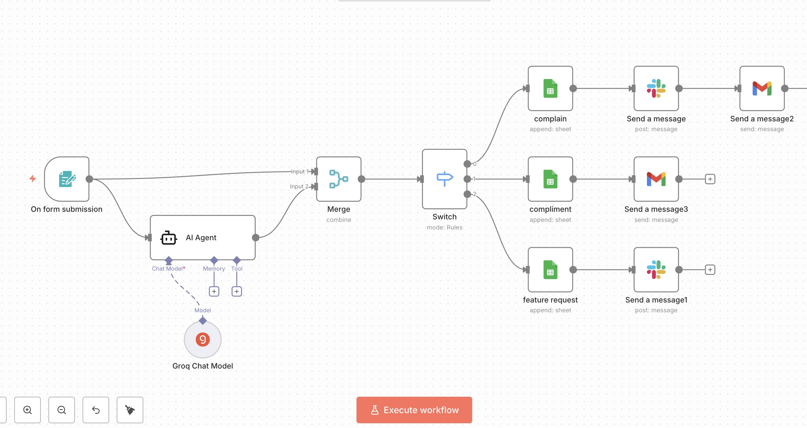

# AI-Powered Feedback Management System

## Overview

An AI-powered workflow built using **n8n** that automatically analyzes customer feedback using **Groq LLM**, categorizes it into **Complaints**, **Compliments**, or **Feature Requests**, stores the results in **Google Sheets**, and automatically sends notifications via **Slack** and **Gmail**.

---

## Features

- 🤖 AI-powered feedback classification using Groq LLM
- 📝 Collects customer feedback using n8n Forms
- 🔀 Automatically categorizes feedback into Complaints, Compliments, and Feature Requests
- 📊 Stores responses in Google Sheets
- 📧 Sends email notifications using Gmail
- 💬 Sends Slack notifications for real-time updates
- ⚡ Fully automated workflow built with n8n

---

## Tech Stack

- n8n
- Groq LLM
- Google Sheets
- Gmail
- Slack
- Docker

---

## Workflow

---

## Demo Video

🎥 **Loom Demo:**  
https://www.loom.com/share/189a066382564d9ca8d4d86fddfffcbf

---

## Workflow File

The exported n8n workflow is included in this repository.

**File:** `ai-feedback-workflow.json`

---

## Author

**Ishika Vashishtha**

Final Year B.Tech Computer Science Student | AI Automation & Workflow Enthusiast
